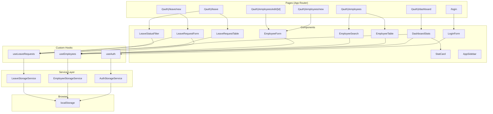
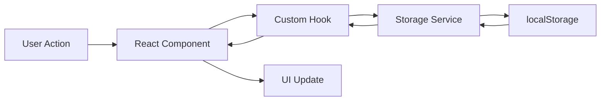

# Employee Leave Management System — Implementation Plan

## Overview

Membangun aplikasi web monolitik **Employee Leave Management System** menggunakan Next.js App Router dengan penyimpanan data di Local Storage (tanpa backend/database). Aplikasi ini memungkinkan admin untuk mengelola data karyawan dan request cuti.

### Referensi Dokumen
- [Mini_Project_Specification_Employee_Leave_System.md](file:///C:/DATA/Project/VIBE%20CODE/Mini_Project_Specification_Employee_Leave_System.md) — Spesifikasi proyek
- [AI_Project_Rules.md](file:///C:/DATA/Project/VIBE%20CODE/AI_Project_Rules.md) — Coding standards & project rules

### Tech Stack
| Technology | Purpose |
|---|---|
| Next.js App Router | Framework & Routing |
| TypeScript | Type Safety |
| Tailwind CSS | Styling |
| ShadCN UI | Component Library |
| React Hook Form | Form Management |
| Zod | Schema Validation |
| Local Storage | Data Persistence |

---

## User Review Required

> [!IMPORTANT]
> **Tailwind CSS Version**: Spesifikasi meminta Tailwind CSS. Saya akan menggunakan **Tailwind CSS v3** karena kompatibilitas terbaik dengan ShadCN UI saat ini. Jika Anda ingin v4, beri tahu saya.

> [!IMPORTANT]
> **ShadCN UI Components**: Saya akan menginstal komponen ShadCN berikut: `button`, `card`, `input`, `label`, `select`, `table`, `dialog`, `toast`, `dropdown-menu`, `badge`, `form`, `calendar`, `popover`, `separator`, `sidebar`, `sheet`. Apakah ada komponen tambahan yang diinginkan?

> [!IMPORTANT]
> **Project Directory**: Proyek baru akan dibuat di `C:\DATA\Project\VIBE CODE\employee-leave-system\`. Apakah lokasi ini sudah sesuai, atau ingin diubah?

---

## Open Questions

> [!NOTE]
> **Seed Data**: Apakah Anda ingin saya menyiapkan data dummy (seed data) untuk testing awal? Misal 5-10 karyawan dan beberapa leave request?

> [!NOTE]
> **Dark Mode**: Spesifikasi tidak menyebutkan dark mode. Apakah ingin saya implementasikan toggle dark/light mode?

> [!NOTE]
> **Confirmation Dialog**: Untuk aksi destructive (delete employee, reject leave), apakah perlu confirmation dialog sebelum eksekusi?

---

## Proposed Changes

Implementasi dibagi menjadi **8 fase** yang diurutkan berdasarkan dependensi. Setiap fase berisi detail file-file yang akan dibuat/dimodifikasi.

---

### Fase 1: Project Scaffolding & Konfigurasi

Setup project Next.js baru dengan semua dependencies dan konfigurasi dasar.

#### 1.1 — Initialize Next.js Project

```bash
npx -y create-next-app@latest ./ --typescript --tailwind --eslint --app --src-dir --import-alias "@/*" --use-npm
```

#### 1.2 — Install Dependencies

```bash
npm install react-hook-form @hookform/resolvers zod uuid date-fns lucide-react
npm install -D @types/uuid
```

#### 1.3 — Initialize ShadCN UI

```bash
npx -y shadcn@latest init
npx -y shadcn@latest add button card input label select table dialog toast dropdown-menu badge form calendar popover separator sheet
```

#### [NEW] `src/types/employee.ts`
Definisi type `Employee` sesuai spesifikasi:
```typescript
export type Employee = {
  id: string;
  name: string;
  department: string;
  position: string;
};
```

#### [NEW] `src/types/leave-request.ts`
Definisi type `LeaveRequest` sesuai spesifikasi:
```typescript
export type LeaveRequest = {
  id: string;
  employeeId: string;
  startDate: string;
  endDate: string;
  reason: string;
  status: "PENDING" | "APPROVED" | "REJECTED";
};
```

#### [NEW] `src/types/auth.ts`
Definisi type untuk autentikasi:
```typescript
export type AuthSession = {
  username: string;
  isAuthenticated: boolean;
  loginAt: string;
};

export type LoginCredentials = {
  username: string;
  password: string;
};
```

#### [NEW] `src/types/index.ts`
Barrel export untuk semua types.

#### [NEW] `src/constants/index.ts`
Konstanta global:
- `STORAGE_KEYS` — keys untuk localStorage (`employees`, `leaveRequests`, `authSession`)
- `VALID_CREDENTIALS` — username/password admin
- `DEPARTMENTS` — daftar department untuk dropdown
- `POSITIONS` — daftar position untuk dropdown
- `LEAVE_STATUS` — enum status cuti
- `MIN_NAME_LENGTH = 3`

---

### Fase 2: Validation Schemas (Zod)

Membuat semua schema validasi menggunakan Zod.

#### [NEW] `src/validators/auth-schema.ts`
- `loginSchema`: validasi username (required) dan password (required)

#### [NEW] `src/validators/employee-schema.ts`
- `employeeSchema`: validasi name (required, min 3 chars), department (required), position (required)

#### [NEW] `src/validators/leave-request-schema.ts`
- `leaveRequestSchema`: validasi employeeId (required), startDate (required), endDate (required, harus > startDate), reason (required)
- Custom refinement: `endDate > startDate`

#### [NEW] `src/validators/index.ts`
Barrel export untuk semua validators.

---

### Fase 3: Service Layer (Local Storage)

Membuat dedicated service layer untuk akses localStorage. **Tidak boleh** akses localStorage langsung dari komponen (sesuai project rules).

#### [NEW] `src/services/auth-storage.ts`
**Class: `AuthStorageService`**
| Method | Deskripsi |
|---|---|
| `login(credentials: LoginCredentials): boolean` | Validasi credential, simpan session |
| `logout(): void` | Hapus session dari localStorage |
| `getSession(): AuthSession \| null` | Ambil session saat ini |
| `isAuthenticated(): boolean` | Cek apakah user sudah login |

#### [NEW] `src/services/employee-storage.ts`
**Class: `EmployeeStorageService`**
| Method | Deskripsi |
|---|---|
| `getAll(): Employee[]` | Ambil semua karyawan |
| `getById(id: string): Employee \| undefined` | Ambil karyawan by ID |
| `create(data: Omit<Employee, 'id'>): Employee` | Buat karyawan baru (generate UUID) |
| `update(id: string, data: Partial<Employee>): Employee` | Update data karyawan |
| `delete(id: string): void` | Hapus karyawan |
| `search(query: string): Employee[]` | Cari karyawan berdasarkan nama |
| `count(): number` | Hitung total karyawan |

#### [NEW] `src/services/leave-storage.ts`
**Class: `LeaveStorageService`**
| Method | Deskripsi |
|---|---|
| `getAll(): LeaveRequest[]` | Ambil semua leave requests |
| `getById(id: string): LeaveRequest \| undefined` | Ambil leave request by ID |
| `create(data: Omit<LeaveRequest, 'id' \| 'status'>): LeaveRequest` | Buat request baru (default status: PENDING) |
| `approve(id: string): LeaveRequest` | Update status ke APPROVED |
| `reject(id: string): LeaveRequest` | Update status ke REJECTED |
| `getByStatus(status: string): LeaveRequest[]` | Filter by status |
| `countByStatus(status: string): number` | Hitung by status |
| `getByEmployeeId(employeeId: string): LeaveRequest[]` | Filter by employee |

---

### Fase 4: Custom Hooks

Membuat custom hooks untuk reusable logic (sesuai project rules).

#### [NEW] `src/hooks/use-auth.ts`
- `useAuth()` — hook untuk auth state management
  - Returns: `{ isAuthenticated, session, login, logout }`
  - Handle redirect ke `/login` jika belum auth
  - Handle redirect ke `/dashboard` jika sudah login dan akses `/login`

#### [NEW] `src/hooks/use-employees.ts`
- `useEmployees()` — hook untuk employee data
  - Returns: `{ employees, isLoading, searchQuery, setSearchQuery, deleteEmployee, refresh }`
  - Includes search/filter logic
  - Re-fetches from localStorage when data changes

#### [NEW] `src/hooks/use-leave-requests.ts`
- `useLeaveRequests()` — hook untuk leave request data
  - Returns: `{ requests, isLoading, statusFilter, setStatusFilter, approve, reject, refresh }`
  - Includes filter by status logic

#### [NEW] `src/hooks/use-local-storage.ts`
- `useLocalStorage<T>(key, initialValue)` — generic hook wrapper untuk localStorage dengan SSR safety (karena Next.js)

---

### Fase 5: Shared/Layout Components

Membuat komponen layout dan shared components.

#### [NEW] `src/components/shared/AppSidebar.tsx`
- Sidebar navigation menggunakan ShadCN Sidebar/Sheet
- Menu items: Dashboard, Employees, Leave Requests, Logout
- Responsive: sidebar di desktop, hamburger/sheet di mobile
- Highlight active route menggunakan `usePathname()`
- Icons menggunakan `lucide-react`

#### [NEW] `src/components/shared/PageHeader.tsx`
- Header untuk setiap halaman
- Props: `title`, `description`, `action` (optional button)

#### [NEW] `src/components/shared/ConfirmDialog.tsx`
- Reusable confirmation dialog menggunakan ShadCN Dialog
- Props: `open`, `onConfirm`, `onCancel`, `title`, `description`, `variant` (danger/default)

#### [NEW] `src/components/shared/StatusBadge.tsx`
- Badge untuk status leave request
- Color coding: PENDING (kuning), APPROVED (hijau), REJECTED (merah)

#### [NEW] `src/components/shared/EmptyState.tsx`
- Komponen untuk state kosong (no data)
- Props: `icon`, `title`, `description`, `action`

#### [MODIFY] `src/app/layout.tsx`
- Setup root layout dengan Toaster provider
- Metadata SEO (title, description)
- Font setup (Inter dari Google Fonts)
- Wrap children dengan auth check

#### [NEW] `src/app/(authenticated)/layout.tsx`
- Layout group untuk halaman yang butuh authentication
- Include sidebar navigation
- Auth guard — redirect ke `/login` jika belum login
- Responsive container

---

### Fase 6: Authentication Module

#### [NEW] `src/components/auth/LoginForm.tsx`
- Form login menggunakan React Hook Form + Zod
- Fields: username (Input), password (Input type="password")
- Validasi: required fields
- Error handling: show toast jika credential salah
- Disable submit button saat processing
- Redirect ke `/dashboard` setelah login sukses

#### [NEW] `src/app/login/page.tsx`
- Halaman login (`/login`)
- Centered card layout
- Logo/title aplikasi
- Render `LoginForm`
- Redirect ke `/dashboard` jika sudah login
- SEO: `<title>Login — Employee Leave System</title>`

---

### Fase 7: Dashboard Module

#### [NEW] `src/components/dashboard/StatCard.tsx`
- Card statistik dashboard
- Props: `title`, `value`, `icon`, `variant` (color scheme)
- Animasi count-up atau transisi halus

#### [NEW] `src/components/dashboard/DashboardStats.tsx`
- Container untuk 4 StatCards:
  1. **Total Employees** — dari `EmployeeStorageService.count()`
  2. **Pending Leaves** — dari `LeaveStorageService.countByStatus("PENDING")`
  3. **Approved Leaves** — dari `LeaveStorageService.countByStatus("APPROVED")`
  4. **Rejected Leaves** — dari `LeaveStorageService.countByStatus("REJECTED")`
- Responsive grid: 1 col (mobile), 2 col (tablet), 4 col (desktop)

#### [NEW] `src/app/(authenticated)/dashboard/page.tsx`
- Halaman dashboard (`/dashboard`)
- Render `PageHeader` + `DashboardStats`
- Real-time count dari localStorage
- SEO: `<title>Dashboard — Employee Leave System</title>`

---

### Fase 8: Employee Management Module

#### 8.1 — Employee List

#### [NEW] `src/components/employee/EmployeeTable.tsx`
- Tabel karyawan menggunakan ShadCN Table
- Columns: Name, Department, Position, Actions
- Actions per row: Edit (link), Delete (button with confirm)
- Empty state jika tidak ada data

#### [NEW] `src/components/employee/EmployeeSearch.tsx`
- Input search untuk filter karyawan by name
- Debounced search (300ms)
- Clear button

#### [NEW] `src/app/(authenticated)/employees/page.tsx`
- Halaman list employees (`/employees`)
- `PageHeader` dengan tombol "Add Employee" → navigasi ke `/employees/new`
- `EmployeeSearch` + `EmployeeTable`
- Integrasi `useEmployees()` hook
- SEO: `<title>Employees — Employee Leave System</title>`

#### 8.2 — Create Employee

#### [NEW] `src/components/employee/EmployeeForm.tsx`
- Form reusable untuk create & edit employee
- Props: `defaultValues?` (untuk edit mode), `onSubmit`, `isEdit`
- Fields:
  - Name — Input (required, min 3 chars)
  - Department — Select dropdown
  - Position — Select dropdown
- Menggunakan React Hook Form + Zod (`employeeSchema`)
- Show validation errors inline
- Disable submit saat processing
- Toast notification on success

#### [NEW] `src/app/(authenticated)/employees/new/page.tsx`
- Halaman create employee (`/employees/new`)
- Render `EmployeeForm` dalam Card
- On submit: `EmployeeStorageService.create()` → redirect ke `/employees`
- SEO: `<title>Add Employee — Employee Leave System</title>`

#### 8.3 — Edit Employee

#### [NEW] `src/app/(authenticated)/employees/edit/[id]/page.tsx`
- Halaman edit employee (`/employees/edit/[id]`)
- Load data existing dari `EmployeeStorageService.getById(id)`
- Handle case: employee not found → redirect ke `/employees` atau show 404
- Render `EmployeeForm` dengan `defaultValues` + `isEdit=true`
- On submit: `EmployeeStorageService.update()` → redirect ke `/employees`
- SEO: `<title>Edit Employee — Employee Leave System</title>`

---

### Fase 9: Leave Request Module

#### 9.1 — Leave Request List

#### [NEW] `src/components/leave/LeaveRequestTable.tsx`
- Tabel leave requests menggunakan ShadCN Table
- Columns: Employee Name (resolved dari employee data), Start Date, End Date, Reason, Status (badge), Actions
- Actions per row:
  - Approve button (hanya tampil jika status PENDING)
  - Reject button (hanya tampil jika status PENDING)
- Format tanggal menggunakan `date-fns`
- Empty state jika tidak ada data

#### [NEW] `src/components/leave/LeaveStatusFilter.tsx`
- Filter dropdown/tabs untuk status: All, Pending, Approved, Rejected
- Menggunakan ShadCN Select atau custom tabs

#### [NEW] `src/app/(authenticated)/leave/page.tsx`
- Halaman list leave requests (`/leave`)
- `PageHeader` dengan tombol "New Leave Request" → navigasi ke `/leave/new`
- `LeaveStatusFilter` + `LeaveRequestTable`
- Integrasi `useLeaveRequests()` hook
- Approve/Reject actions dengan confirmation dialog
- Toast notification on success
- SEO: `<title>Leave Requests — Employee Leave System</title>`

#### 9.2 — Create Leave Request

#### [NEW] `src/components/leave/LeaveRequestForm.tsx`
- Form untuk create leave request
- Fields:
  - Employee — Select dropdown (populated dari `EmployeeStorageService.getAll()`)
  - Start Date — Date picker (ShadCN Calendar + Popover)
  - End Date — Date picker (validasi: harus > startDate)
  - Reason — Textarea
- Menggunakan React Hook Form + Zod (`leaveRequestSchema`)
- Cross-field validation: endDate > startDate
- Show validation errors inline
- Disable submit saat processing
- Toast notification on success

#### [NEW] `src/app/(authenticated)/leave/new/page.tsx`
- Halaman create leave request (`/leave/new`)
- Render `LeaveRequestForm` dalam Card
- On submit: `LeaveStorageService.create()` → redirect ke `/leave`
- Handle edge case: no employees → show message to create employee first
- SEO: `<title>New Leave Request — Employee Leave System</title>`

---

### Fase 10: Middleware & Auth Guard

#### [NEW] `src/middleware.ts`
- Next.js middleware untuk route protection
- Redirect ke `/login` jika belum auth dan akses protected routes
- Redirect ke `/dashboard` jika sudah auth dan akses `/login`
- **Catatan**: Karena localStorage tidak tersedia di middleware (server-side), auth guard utama akan dilakukan di client-side melalui layout component

#### [NEW] `src/lib/utils.ts`
- Utility functions:
  - `cn()` — classname merger (sudah include dari ShadCN init)
  - `formatDate(date: string): string` — format tanggal display
  - `generateId(): string` — wrapper untuk UUID generation

---

## Ringkasan Seluruh File

### Files Baru (New)

| # | Path | Deskripsi |
|---|---|---|
| 1 | `src/types/employee.ts` | Type Employee |
| 2 | `src/types/leave-request.ts` | Type LeaveRequest |
| 3 | `src/types/auth.ts` | Type Auth/Session |
| 4 | `src/types/index.ts` | Barrel export |
| 5 | `src/constants/index.ts` | Konstanta global |
| 6 | `src/validators/auth-schema.ts` | Login validation schema |
| 7 | `src/validators/employee-schema.ts` | Employee validation schema |
| 8 | `src/validators/leave-request-schema.ts` | Leave request validation schema |
| 9 | `src/validators/index.ts` | Barrel export validators |
| 10 | `src/services/auth-storage.ts` | Auth localStorage service |
| 11 | `src/services/employee-storage.ts` | Employee localStorage service |
| 12 | `src/services/leave-storage.ts` | Leave localStorage service |
| 13 | `src/hooks/use-auth.ts` | Auth hook |
| 14 | `src/hooks/use-employees.ts` | Employee data hook |
| 15 | `src/hooks/use-leave-requests.ts` | Leave request data hook |
| 16 | `src/hooks/use-local-storage.ts` | Generic localStorage hook |
| 17 | `src/components/shared/AppSidebar.tsx` | Navigation sidebar |
| 18 | `src/components/shared/PageHeader.tsx` | Page header |
| 19 | `src/components/shared/ConfirmDialog.tsx` | Confirmation dialog |
| 20 | `src/components/shared/StatusBadge.tsx` | Status badge |
| 21 | `src/components/shared/EmptyState.tsx` | Empty state |
| 22 | `src/components/auth/LoginForm.tsx` | Login form |
| 23 | `src/components/dashboard/StatCard.tsx` | Dashboard stat card |
| 24 | `src/components/dashboard/DashboardStats.tsx` | Dashboard stats container |
| 25 | `src/components/employee/EmployeeTable.tsx` | Employee list table |
| 26 | `src/components/employee/EmployeeSearch.tsx` | Employee search input |
| 27 | `src/components/employee/EmployeeForm.tsx` | Employee create/edit form |
| 28 | `src/components/leave/LeaveRequestTable.tsx` | Leave request list table |
| 29 | `src/components/leave/LeaveStatusFilter.tsx` | Leave status filter |
| 30 | `src/components/leave/LeaveRequestForm.tsx` | Leave request form |
| 31 | `src/app/login/page.tsx` | Login page |
| 32 | `src/app/(authenticated)/layout.tsx` | Auth layout with sidebar |
| 33 | `src/app/(authenticated)/dashboard/page.tsx` | Dashboard page |
| 34 | `src/app/(authenticated)/employees/page.tsx` | Employee list page |
| 35 | `src/app/(authenticated)/employees/new/page.tsx` | Create employee page |
| 36 | `src/app/(authenticated)/employees/edit/[id]/page.tsx` | Edit employee page |
| 37 | `src/app/(authenticated)/leave/page.tsx` | Leave request list page |
| 38 | `src/app/(authenticated)/leave/new/page.tsx` | Create leave request page |
| 39 | `src/middleware.ts` | Route protection middleware |
| 40 | `src/lib/utils.ts` | Utility functions |

### Files yang Dimodifikasi (Modify)

| # | Path | Deskripsi |
|---|---|---|
| 1 | `src/app/layout.tsx` | Root layout + metadata + font + toaster |
| 2 | `src/app/page.tsx` | Root redirect ke `/dashboard` atau `/login` |
| 3 | `tailwind.config.ts` | ShadCN theme extension (jika diperlukan) |

---

## Diagram Arsitektur



---

## Diagram Alur Data



---

## Verification Plan

### Automated Verification

```bash
# 1. Type checking
npx tsc --noEmit

# 2. Lint checking
npm run lint

# 3. Build test
npm run build

# 4. Dev server
npm run dev
```

### Manual Verification Checklist

#### Authentication
- [ ] Login dengan credential benar → redirect ke dashboard
- [ ] Login dengan credential salah → tampil error message
- [ ] Akses halaman protected tanpa login → redirect ke login
- [ ] Logout → session dihapus, redirect ke login
- [ ] Refresh halaman → session tetap preserved

#### Dashboard
- [ ] Tampil 4 cards dengan count yang benar
- [ ] Count update real-time saat data berubah
- [ ] Layout responsive di mobile/tablet/desktop

#### Employee Management
- [ ] List semua employees
- [ ] Search employee by name → filter real-time
- [ ] Create employee → validasi form → simpan → redirect ke list
- [ ] Edit employee → load data existing → update → redirect
- [ ] Delete employee → confirmation → hapus dari list
- [ ] Validasi: name minimal 3 karakter
- [ ] Validasi: semua field required

#### Leave Request Management
- [ ] List semua leave requests
- [ ] Filter by status (All/Pending/Approved/Rejected)
- [ ] Create leave request → pilih employee → set dates → simpan
- [ ] Validasi: end date harus > start date
- [ ] Approve request → status berubah ke APPROVED
- [ ] Reject request → status berubah ke REJECTED
- [ ] Tombol approve/reject hanya tampil untuk status PENDING

#### Cross-Module
- [ ] Dashboard count sinkron dengan data aktual
- [ ] Delete employee → leave requests terkait tetap ada (data integrity note)
- [ ] Semua data persist setelah refresh halaman
- [ ] Responsive di semua breakpoints

---

## Estimasi Effort

| Fase | Deskripsi | Estimasi |
|---|---|---|
| 1 | Project Scaffolding & Config | ~15 menit |
| 2 | Validation Schemas | ~5 menit |
| 3 | Service Layer | ~15 menit |
| 4 | Custom Hooks | ~10 menit |
| 5 | Shared Components & Layout | ~20 menit |
| 6 | Authentication Module | ~10 menit |
| 7 | Dashboard Module | ~10 menit |
| 8 | Employee Management | ~25 menit |
| 9 | Leave Request Module | ~25 menit |
| 10 | Middleware & Polish | ~10 menit |
| — | **Total** | **~2.5 jam** |
